# WingFoil — Workflow Reference

This document describes the complete workflow configuration for the WingFoil project as defined in
`.wingfoil/` (this directory). The single startable lifecycle is `sw-life-cycle`; four independent
**ingest mains** can be started on demand at any time.

---

## Software Life Cycle — `sw-life-cycle`

The end-to-end lifecycle from product discovery to end-of-life. Inception, specification, init,
and sunset run once; `release-line-cycle` iterates once per major version (v1, v2, ...) and
contains its own `initial-design` + `delivery` sub-phases — reusable as-is when a new major
version starts, without re-running `wingfoil-init`.

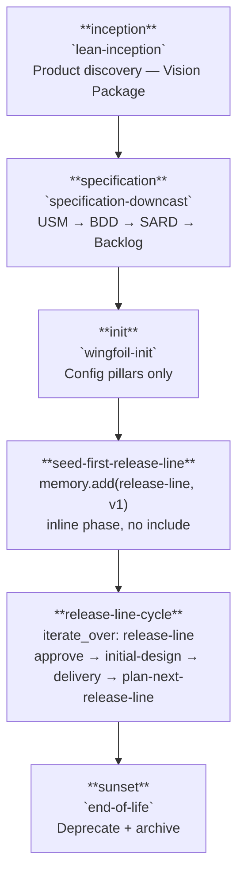

---

## Phase 1 — Inception: `lean-inception`

Five sessions transform the Product Brief into the Vision Package.
Input: `docs/01_vision/01_product-brief.md`.

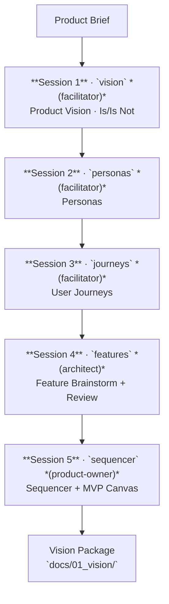

**Outputs:** `product-vision.md`, `is-isnot.md`, `personas.md`, `journeys.md`, `features.md`,
`sequencer.md`, `mvp-canvas.md`.

---

## Phase 2 — Specification: `specification-downcast`

Four modules in strict sequence. Each module ends with a Stop-Check gate before the next begins.
Input: the full Vision Package from Phase 1.

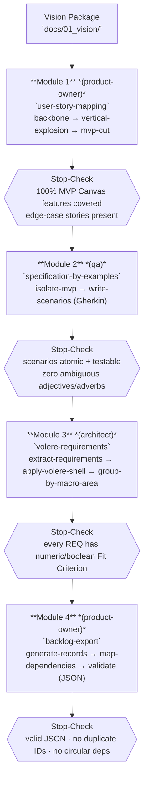

**Outputs:** `docs/02_requirements/01_user_story_map/`, `02_bdd/`, `03_sard/`,
`docs/03_backlog/04_backlog/`.

---

## Phase 3 — Init: `wingfoil-init`

Runs once, ever, between specification and the first release-line. Pure config/tooling bootstrap:
creates the four WingFoil configuration pillars. No Memory content at all — no release roadmap, no
ADRs/Decision Logs/tech-specs; those all moved to `release-line-cycle` (Phase 5) so they can run
again for v2, v3, ... without repeating this phase.

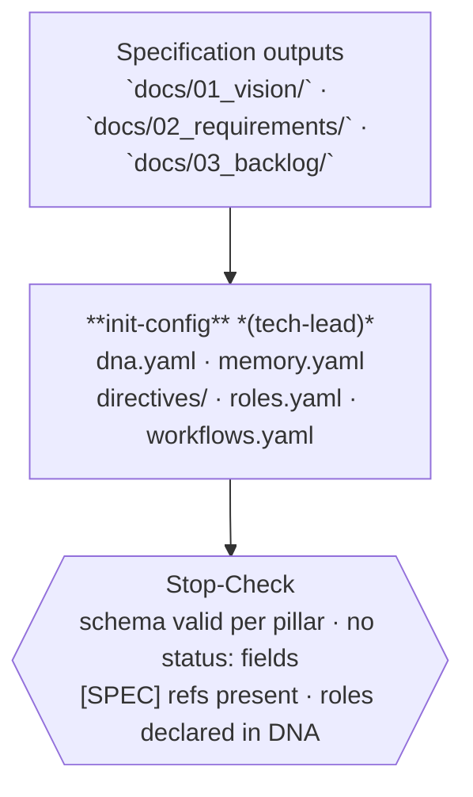

---

## Phase 4 — Seed First Release Line

Runs once, ever, right after init — an inline `sw-life-cycle` phase (no `include:`), since it just
seeds the single input `release-line-cycle` (Phase 5) needs to start.

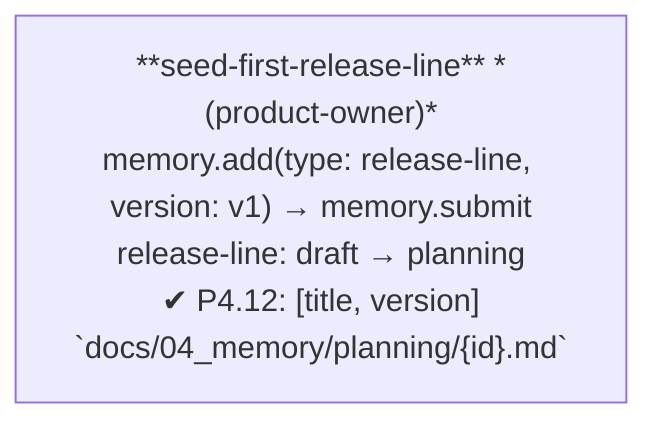

Every *subsequent* release-line (v2, v3, ...) is **self-seeded** instead — by `plan-next-release-line`
at the end of the previous release-line-cycle iteration (Phase 5 below). This is the only place in
the whole config where a workflow creates an element of the same type its own outer loop iterates
over; it fits the existing `iterate_over` + `where` semantics (always a live query against current
Memory state, REQ-SYS-03 — never a fixed snapshot), just not previously exercised this way.

---

## Phase 5 — Release Line: `release-line-cycle`

Iterated once per release-line (`iterate_over: release-line`, `where: status ∈ [planning, active]`).
Composes the release-line-scoped setup (`initial-design`) with the per-release delivery loop
(`delivery`), re-aligns the agent-facing docs (`align-agent-docs`, the `agent-docs` workflow user-docs
runs per release, dl-025), then closes the release-line and self-seeds the next one.

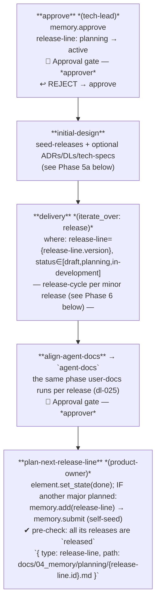

### Phase 5a — Initial Design: `initial-design`

Runs once per release-line-cycle iteration — reusable as-is for v2, v3, ... Generates this
release-line's minor-release roadmap, then records the architecture/product decisions and
artefact specs already implied by it. `seed-releases` is required; the other three are optional.

```mermaid
flowchart TD
    IN2["`approve` output\nrelease-line: active"]

    P2b["**seed-releases** *(product-owner)*\nmemory.add(type: release, release-line: {release-line.version}, kind: minor) × N\nstatus: draft (no pending state)\n✔ P4.12: [title, kind, version, pillar, features, requirements, release-line]\n(kind exempt for minor-v0.1 … minor-v1.0)\n`{ type: release, path: docs/04_memory/planning/rl-{release-line.version}/{release.id}.md }`"]
    SC2b{{"Stop-Check\nN files · all draft\nfeatures list complete per release"}}

    P3["**seed-adrs** *(architect)* · **OPTIONAL**\nmemory.add(type: adr)\ndraft → pending → accepted\n✔ P4.12: [title, sard_ref]\n`{ type: adr, path: docs/04_memory/design/adrs/{adr.id}.md }`"]
    SC3{{"Stop-Check\nSARD ref present · Context/Decision/Consequences\nall ADRs status: accepted"}}

    P4["**seed-dls** *(architect)* · **OPTIONAL**\nmemory.add(type: decision-log)\ndraft → in-discussion → ready\n✔ P4.12: [title]\n`{ type: decision-log, path: docs/04_memory/design/dls/{decision-log.id}.md }`"]
    SC4{{"Stop-Check\nContext/Decision/Consequences\nall DLs status: approved"}}

    P5["**seed-specs** *(architect)* · **OPTIONAL**\nagent.execute: survey (this release-line) → memory.add(type: tech-spec)\ndraft → pending → approved\n✔ P4.12: [title, scope]\n`{ type: tech-spec, path: docs/04_memory/design/specs/{tech-spec.id}.md }`"]
    SC5{{"Stop-Check\nnot already covered by an approved spec\nall specs status: approved"}}

    IN2 --> P2b --> SC2b --> P3 --> SC3 --> P4 --> SC4 --> P5 --> SC5

    style P3 fill:#f9f9f9,stroke:#bbb,stroke-dasharray:5 5
    style SC3 fill:#f9f9f9,stroke:#bbb,stroke-dasharray:5 5
    style P4 fill:#f9f9f9,stroke:#bbb,stroke-dasharray:5 5
    style SC4 fill:#f9f9f9,stroke:#bbb,stroke-dasharray:5 5
    style P5 fill:#f9f9f9,stroke:#bbb,stroke-dasharray:5 5
    style SC5 fill:#f9f9f9,stroke:#bbb,stroke-dasharray:5 5
```

`seed-specs` is the release-line-wide sibling of `release-planning`'s `identify-specs` (Phase 6
below): same survey logic, but for artefacts spanning this whole release-line rather than one
release's task scope (e.g. `memory.yaml`'s own schema). `identify-specs` already dedupes against
"not yet covered by an approved spec", so nothing seeded here is re-created once a release's own
delivery starts.

---

## Phase 6 — Delivery: `release-cycle`

Iterated once per release (`iterate_over: release`, `where: release-line = {release-line.version},
status ∈ [draft, planning, in-development]` — scoped to the current release-line-cycle iteration).
Eight phases in sequence, each including one sub-workflow: `planning` (`release-planning`),
`implementation` (`dev-loop`), `user-docs` (`user-docs`, dl-013/dl-025), `e2e-smoke` (`e2e-smoke`,
dl-023), `submit` (`release-submit`), `publishing` (`release-publishing`), `release-health`
(`release-health`, dl-089) and `retrospective` (`retrospective`). A patch runs every phase except
`retrospective` (dl-092); its release-health run reports D01 as not-comparable.

```mermaid
flowchart TD
    RP["**planning** → `release-planning`\nadvance-pinned-build → define-scope → triage-bugs → reconcile-governance\n→ record-adrs (opt.) → identify-specs → build-backlog → commit-backlog\n✔ P4.12 per step (see sub-diagram below)\n🔑 Approval gates — *approver*\nrelease: draft → planning → in-development"]

    DL["**implementation** → `dev-loop` *(iterate_over: task)*\nwhere: status=backlog, tags=[release.version]\n— design gate + TDD cycle per task, incl. bug-fix tasks —\nkeeps source bug in sync via bug.sync_state"]

    UD["**user-docs** → `user-docs`\ncheck-implementation-complete → align-user-docs → align-agent-docs\n🔑 Approval gates — *approver*\n(see sub-diagram below)"]

    ES["**e2e-smoke** → `e2e-smoke`\nfresh-init → drive-cli → mcp-registration → gate\n🔑 Approval gate — *approver*\n(see sub-diagram below)"]

    RS["**submit** → `release-submit`\npre-release-checks → enter-releasing → approve-release\n✔ tests.no-identity: the suite with no git identity\n🔑 Approval gate — *approver*\nrelease: in-development → releasing\n↩ REJECT → pre-release-checks"]

    RP2["**publishing** → `release-publishing`\nrelease-commit → staging-rehearsal → tag → publish → mark-released\nrelease commit = the candidate · staging rehearsal on it · git tag · npm stage publish + approve\n🔑 Approval gate — *approver*\nrelease: releasing → released\n(see sub-diagram below)"]

    RT["**retrospective** → `retrospective`\nexplore → additional-points → capture → approve\nexplore reads every Retrospective subsection first, lists its secondary sources (dl-115), the release-health report among them\n✔ pre additional-points: every proposal and every consumer note has one outcome (four; six for a consumer note, dl-163)\n✔ P4.12: [title]\n🔑 Approval gates — *approver* (approve: decision-log.set_state(ready), retro in-discussion → ready)\nOUTPUT: `docs/04_memory/design/dls/retro-{release.version}.md`"]

    RH["**release-health** → `release-health`\nmeasure → compare → propose\ncatalogue `docs/08_health/metrics.yaml` · report `docs/08_health/release-health-{version}.md`\nnot a gate (dl-089 §5)"]

    RP --> DL --> UD --> ES --> RS --> RP2 --> RH --> RT
    RP2 -.->|re-cut candidate| ES
```

**Release candidate** (`dl-099` §1): the commit of the release's integration branch proposed for the
version tag, cut by `release-publishing`'s `release-commit`. The two checks are the `e2e-smoke` gate,
which packs and smokes the candidate with its build stamp bound (`e2e-smoke-passed`, `--candidate`), and
`staging-rehearsal`. The release commit does not re-cut the candidate: `e2e-smoke` runs before it, so on
the first candidate the rehearsal's smoke (the same scenario of `scripts/e2e-smoke.cjs`, against the staged
tarball, with `--expect-commit`) stands as its e2e-smoke run. A commit that must ship and lands
after the checks ran **re-cuts** the candidate: the release re-enters `e2e-smoke` (and `submit`'s checks),
then `staging-rehearsal`. Only a candidate that passed both is tagged; a commit that only records evidence
(a gate report, a transcript, a Memory transition) does not re-cut, because `tag` tags the candidate the
rehearsal transcript names.

### Dev Loop — `dev-loop`

Iterated once per task (`iterate_over: task`) — including fix tasks derived from bugs. A `design`
gate precedes the TDD red-green-refactor cycle; rejection at review sends the task back to `red`.
Every phase that changes the task's state also calls `bug.sync_state`: a no-op unless the task
carries a `bug:` field, in which case it recomputes the source bug's own state from the aggregate
progress of *all* its derived fix tasks (task and bug share the `in-progress`/`in-review` state
names by design, so no separate bug-fix workflow is needed). The reject path has its own sync, the
first action of `red` (`dl-061`): whoever performs the reject emits it right after, citing the
reject commit.

Separation of duties (`dl-134`, v1.5): `red` is `qa`'s, black-box, and `green` and `refactor` leave
the files `red`'s commit touched unchanged (`tests.unchanged(since: red)`, evaluated from v1.0).
`green` never shares an agent session with `red`, `refactor` may resume `green`'s, and `review`
shares none with the three; the reviewer loads the developer's and `qa`'s directives too. A task
resumed after a reject or a park merges `main` at the start of `red`, run by the developer before
`qa` writes a test, and again as `refactor`'s last action if `main` moved, so the checks and the
review measure the merged tree (`dl-035`; approver ruling 2026-10-09). `memory park` returns a started
task to the backlog: its branch is kept, its worktree removed, its bugs synced back to `planned`
(`dl-110`).

The v0.3 gates (v1.6, `task-221`): `start` refuses a feature task while open fix tasks are more than
the share `memory.yaml` `task.stop_the_line` declares (`dl-133`); `design` reads each acceptance
criterion against the bound directives and the ratified specs (`dl-102` §4); `refactor` also runs
`typecheck.clean` (`dl-044`); `review` re-runs the summary's claims (`dl-097`), re-verifies a previous
reject's items first on a re-review (`dl-098`) and runs the document-parity suites (`docs.parity`,
`dl-116`); `done` checks that the task's `### Retrospective` subsection exists, and that of each bug
it closes (`dl-115`). No check is evaluated before v1.0 (P4.12); until then the phase's role applies it.

```mermaid
flowchart TD
    ST["**start** *(developer)*\n✔ pre: stop-the-line clear (feature tasks only, dl-133)\ngit.create_branch(task: {task.id}) → branch task/{task.id}\ntask: backlog → in-progress\n↳ bug.sync_state: source bug planned → in-progress"]
    DES["📐 **design** *(architect)* · safety net\nverify a tech-spec exists + is approved for every\nfile format/schema/constant/API the task implements\n✔ P4.12: [title, scope] (if scaffolded) + tech-spec: approved\n✔ each AC consistent with the directives and specs (dl-102)"]
    RED["🔴 **red** *(qa)* · fresh\n↳ bug.sync_state: source bug in-review → in-progress (after a reject)\ndeveloper merges main first (on a resume)\nwrite the tests black-box from the ACs\n✔ tests.exist + tests.failing"]
    GREEN["🟢 **green** *(developer)* · distinct from red\nmin code to pass\n✔ tests.passing + tests.unchanged(since: red)"]
    REF["🔵 **refactor** *(developer)* · may resume green\nclean code, keep tests green\nlast: merge main (if it moved)\n✔ tests.passing + coverage ≥ 80% + lint + typecheck + tests.unchanged(since: red)"]
    REV["📋 **review** *(reviewer)* · distinct from red, green, refactor\n✔ pre: BDD + claims re-run + previous reject re-verified + docs.parity\ntask: in-progress → in-review\n↳ bug.sync_state: source bug → in-review (once ALL its fix tasks are)\n🔑 Approval gate — *approver*"]
    DONE["✅ **done** *(developer)*\ngit merge to main\ntask: in-review → approved → done\n↳ bug.sync_state: source bug → resolved → closed (once ALL its fix tasks are done)\n✔ ### Retrospective present (task, closed bugs)"]

    ST --> DES --> RED --> GREEN --> REF --> REV
    REV -->|APPROVE| DONE
    REV -->|REJECT| RED
```

`design` is a fallback: most artefacts should already have an approved tech-spec from
`release-planning`'s `identify-specs` step; this gate only catches artefacts discovered while
implementing the task (detail not predictable at planning time).

### Release Planning — `release-planning`

Eight steps in sequence; `record-adrs` is optional. `advance-pinned-build` moves the pinned
published build forward first (dl-095); `triage-bugs` and `reconcile-governance` sweep in-scope
`open` bugs and not-ready decision-logs/ADRs into their gated states (dl-016), selecting only
elements whose `release` is empty or this release. Each `memory.add` step carries a P4.12 check gate
enforcing the required frontmatter fields before the next step begins. `define-scope`'s gate exempts
the releases added before dl-092 (`minor-v0.1` … `minor-v1.0`) from `kind`, which they do not carry
(bug-175).

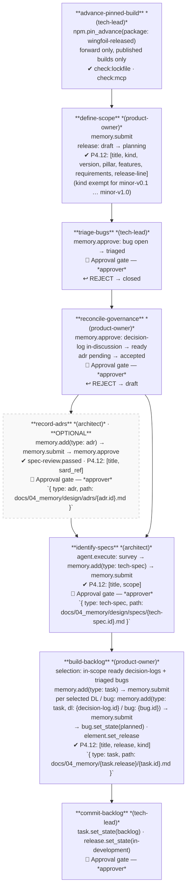

`identify-specs` surveys the release scope for file formats, schemas, constant sets, and module
APIs implied by its tasks, and scaffolds a tech-spec draft for each one not yet covered by an
approved spec — proactively, before `build-backlog` creates the tasks that will implement them.
`dev-loop/design` (above) remains as a reactive fallback for artefacts discovered only during
implementation.

### User Docs — `user-docs`

The documentation gate between `implementation` and `submit` (dl-013), which also owns the
agent-facing documents (dl-025). It starts only once every task of the release is `done`.

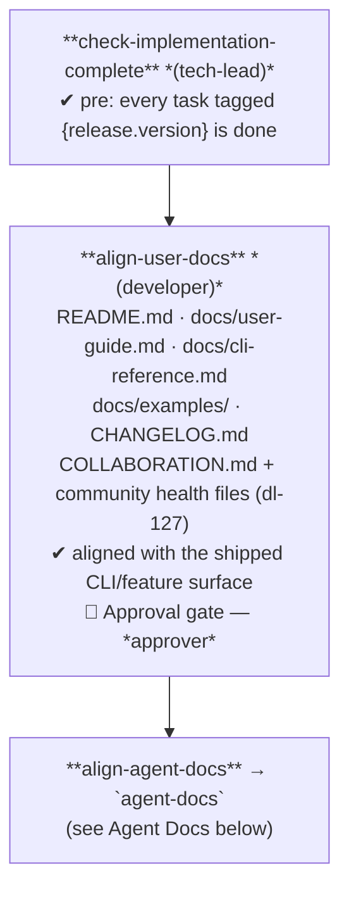

### Agent Docs — `agent-docs`

The agent-facing documentation gate (dl-025, shape B), a workflow of one phase so that two callers
run the same phase: `user-docs` per release, and `release-line-cycle` right before
`plan-next-release-line` closes a release-line (dl-025's open question, ratified: structural changes
land at release-line boundaries). It declares no `element`, so either caller may include it.

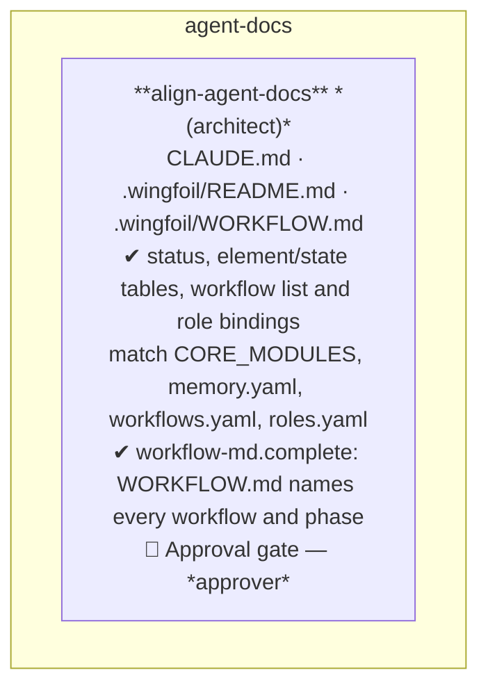

### E2E Smoke — `e2e-smoke`

The end-to-end gate before `submit` (dl-023): a fresh `wingfoil init` per template, driven through a
use scenario (dl-099 §3) by `scripts/e2e-smoke.cjs`, and the repository's MCP registration checked. The
gate hard-rejects, and its report is the phase's evidence (`produces:`, bug-134). The same smoke runs
on every push in `ci.yml`'s `e2e-smoke` job, against the packed tarball.

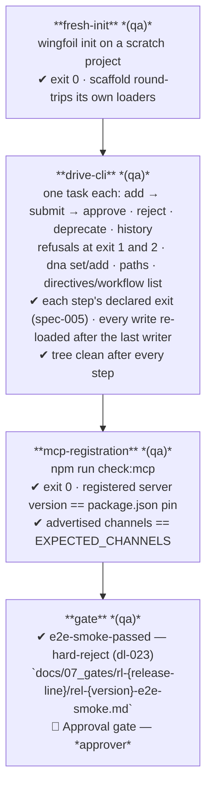

### Release Publishing — `release-publishing`

The release commit is its own phase, so the staging rehearsal runs on the candidate it cuts (`dl-099`
§2, task-219). The rehearsal starts a local Verdaccio registry, so it runs per candidate and never in CI.

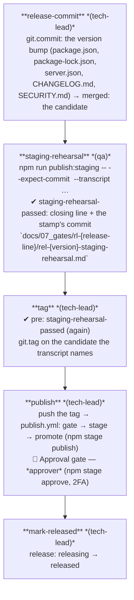

### Release Health — `release-health`

Runs after `publishing` and before `retrospective` on every release (dl-089). It measures the release at
its measurement point — the published tag, else the commit carrying the `released` transition — with the
fixed catalogue `docs/08_health/metrics.yaml` (version 2: git history G, project quality Q, the
Determinism Index's outcome D01 and process conformance P, the external snapshot E), compares every
metric with the previous release's run and turns each regression or breached floor into an
`RH-{version}-NN` proposal for the retrospective. It blocks nothing; a breach of G07, G10, G14, Q01 or Q02
is filed at once through `bug-ingest`. `release-health.measure` / `.compare` are bound to
`scripts/release-health/measure.cjs` / `compare.cjs`, to be written by task-231..233 (measure) and task-241 (compare);
dl-089 §6 forbids them writing git configuration.

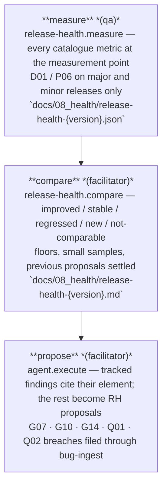

---

## Phase 7 — Sunset: `end-of-life`

Retires the product or a major line. Documents remain in the repository (agents ignore deprecated
content, REQ-STATE-06).

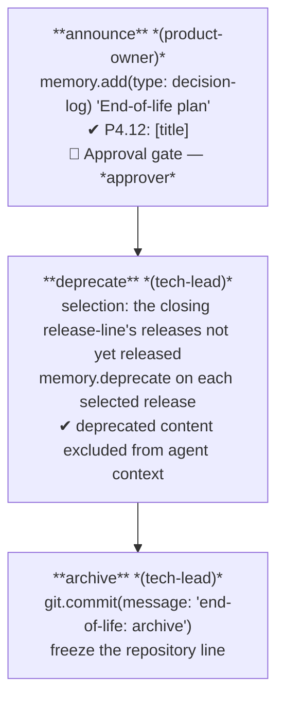

---

## Ingest Mains

Four lightweight `kind: main` workflows startable on demand at any point during the project
(REQ-STATE-03 allows multiple open mains concurrently).

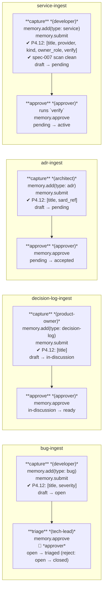

| Workflow | Produces | Typical trigger |
|---|---|---|
| `bug-ingest` | `docs/04_memory/bugs/{id}.md` | Defect found during dev-loop or testing |
| `decision-log-ingest` | `docs/04_memory/design/dls/{id}.md` | Ad-hoc product/process decision |
| `adr-ingest` | `docs/04_memory/design/adrs/{id}.md` | Architectural decision during any phase |
| `service-ingest` | `docs/04_memory/services/{id}.md` | External state set up (account, credential by reference, listing, setting, domain, handle — `dl-088`) |

---

## Token Bindings — `workflows/bindings.yaml`

Every `actions:` and `checks:` token resolves through a binding (spec-003 Layer 3, dl-090). The
`memory.*`, `set_state` / `sync_state`, `element.set_release`, `config.init` and `agent.*` tokens are
built in (`agent.*` is `wingfoil agent execute` under the phase's role; the instruction is the phase's
`description`). Every other token is bound in `.wingfoil/workflows/bindings.yaml` (`format: 1`,
dl-153): a check to an argument vector (`npm test`, `npm run lint`, `npm run docs:api`,
`npm run typecheck`, `npm run check:lockfile`, `npm run check:mcp`, `node scripts/e2e-smoke.cjs`, …),
an action to a command (`release-health.measure` / `.compare`, `node scripts/release-health/…`, scripts still to be written) or `manual: true` (the `git.*` steps, `npm.pin_advance`, `cli.run`,
`approver.execute`). Token arguments are `key: value` pairs, substituted as whole argv elements, never
through a shell. The prose checks no command asserts yet (`frontmatter.required: […]`,
`spec-review.passed`, the specification-phase quality criteria, …) stay unbound: `workflow list` reports
each as a `W_WORKFLOW_UNBOUND_TOKEN` warning, which fails closed once the engine runs checks (v1.0).

---

## Memory Element State Machines

State is derived from Memory file frontmatter at runtime — no separate state index (REQ-SYS-03).
`memory.deprecate` can be called from any state on any type.

### Release Line

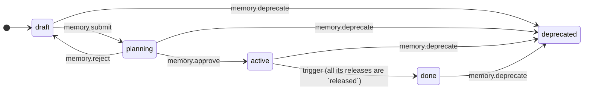

### Release

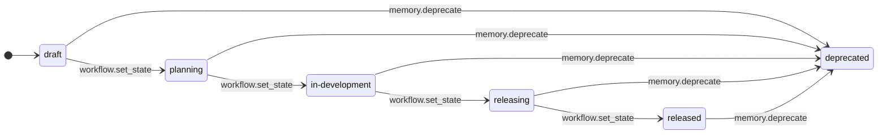

### Task

```mermaid
stateDiagram-v2
    direction LR
    [*] --> draft
    draft --> pending : memory.submit
    pending --> backlog : task.set_state (approved)
    pending --> draft : memory.reject (reopen)
    backlog --> in_progress : workflow.set_state
    in_progress --> in_review : memory.submit
    in_review --> approved : memory.approve
    in_review --> in_progress : memory.reject (back to red)
    in_progress --> backlog : memory park (dl-110)
    approved --> done : workflow.set_state

    in_progress : in-progress
    in_review : in-review
```

### ADR

```mermaid
stateDiagram-v2
    direction LR
    [*] --> draft
    draft --> pending : memory.submit
    pending --> accepted : memory.approve
    pending --> draft : memory.reject
    accepted --> superseded : waiting (a later ADR's supersedes:, no CLI verb)
    accepted --> deprecated : memory.deprecate
    superseded --> deprecated : memory.deprecate
```

### Tech Spec

```mermaid
stateDiagram-v2
    direction LR
    [*] --> draft
    draft --> pending : memory.submit
    pending --> approved : memory.approve
    pending --> draft : memory.reject
    approved --> superseded : waiting (a later spec's supersedes:, no CLI verb)
    approved --> deprecated : memory.deprecate
    superseded --> deprecated : memory.deprecate
```

### Decision Log  *(own machine — `dl-012` as reduced by `dl-017`)*

```mermaid
stateDiagram-v2
    direction LR
    [*] --> draft
    draft --> in_discussion : memory.submit
    in_discussion --> ready : memory.approve
    in_discussion --> draft : memory.reject
    ready --> deprecated : memory.deprecate

    in_discussion : in-discussion
```

### Bug

```mermaid
stateDiagram-v2
    direction LR
    [*] --> draft
    draft --> open : memory.submit
    open --> triaged : memory.approve
    open --> closed : memory.reject (wontfix / duplicate)
    triaged --> planned : bug.set_state (release-planning/build-backlog, fix task(s) created)
    triaged --> closed : memory.reject (wontfix after triage, dl-123)
    planned --> closed : memory.reject (wontfix before the fix starts, dl-123)
    planned --> in_progress : bug.sync_state (dev-loop, first fix task starts)
    in_progress --> in_review : bug.sync_state (dev-loop, ALL fix tasks in review)
    in_review --> resolved : bug.sync_state (dev-loop, ALL fix tasks done)
    in_review --> in_progress : memory.reject (reopen); bug.sync_state (dev-loop red, after a task reject, dl-061)
    in_progress --> planned : bug.sync_state (dev-loop, the fix task is parked, dl-110) — the bug `returns` edge
    resolved --> closed : bug.sync_state (dev-loop, ALL fix tasks done)
    resolved --> in_progress : memory.reject (reopen)
    closed --> deprecated : memory.deprecate

    in_progress : in-progress
    in_review : in-review
```

### Plan  *(`dl-019` — phase-plan execution scaffold)*

```mermaid
stateDiagram-v2
    direction LR
    [*] --> draft
    draft --> active : memory.submit (the phase starts)
    active --> done : workflow (the phase's produces:/checks hold)
    draft --> deprecated : memory.deprecate
    active --> deprecated : memory.deprecate
```

### Service  *(`dl-088` — external state, never a secret value)*

```mermaid
stateDiagram-v2
    direction LR
    [*] --> draft
    draft --> pending : memory.submit (set up and described)
    pending --> active : memory.approve (the approver ran verify)
    pending --> draft : memory.reject
    active --> deprecated : memory.deprecate (dropped or replaced)
```

---

## Roles Summary

| Role | Responsibilities in workflows |
|---|---|
| `product-owner` | Release-line seeding/closing (`seed-first-release-line`, `plan-next-release-line`), release-line roadmap (`seed-releases`), release planning, scope definition, governance reconcile, backlog creation |
| `tech-lead` | Config init, release-line approval, pinned-build advance, bug triage, backlog approval, implementation-complete check, release submission and publishing, deprecation |
| `architect` | Features session, Volere requirements, ADR authoring, tech-spec identification/authoring (`identify-specs`, `dev-loop/design`), agent-facing docs (`align-agent-docs`) |
| `developer` | TDD dev-loop (green/refactor), branch management, user-facing docs (`align-user-docs`), bug capture, service capture |
| `reviewer` | Code review in dev-loop (tests and code, under the developer's and qa's directives too, `dl-134`) |
| `qa` | BDD specification, the dev-loop `red` phase (black-box tests, `dl-134`), end-to-end smoke (`e2e-smoke`), pre-release checks, release-health measurement (`measure`) |
| `facilitator` | Lean inception sessions, release-health comparison and proposals (`compare`, `propose`), retrospective exploration and capture |
| `approver` | All approval gates (bug triage, governance reconcile, backlog commit, task review, documentation, e2e smoke, release, retrospective, end-of-life, service verification) |
