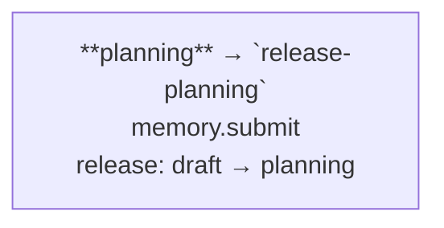

# A drifted WORKFLOW.md (task-187 fixture, bug-206)

The registry the test pairs with this file: `release-cycle` (phases `planning`, `submit`) and
`e2e-smoke` (phases `fresh-init`, `gate`). This copy documents `planning` and `fresh-init` in their
own sections, and names `submit` and `gate` only where they do not document those phases.

## Phase 6 — Delivery: `release-cycle`

### E2E Smoke — `e2e-smoke`

## Elsewhere

Every Memory operation commits: `memory.submit` writes a commit, and the release-planning gate
approves. Nothing here documents a phase of `release-cycle` or of `e2e-smoke`.
